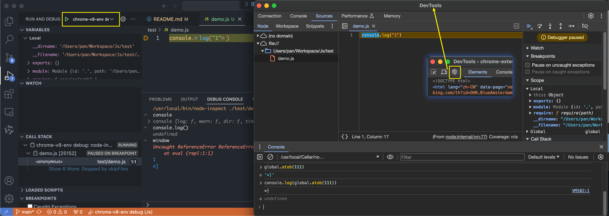

# JS 逆向工具库

## 环境搭建

### JS 代码调试

1. npm 环境
   1. `npm install -g npm-inspect`
   2. `npm install -g vm2`
2. vscode 环境
   1. Run - Add configuration - [launch.json](.vscode/launch.json)
   配置 `node` 为本地调试命令，`node-inspect` 为 chrome-v8 联调命令
   2. 插件: Code Runner
   右键文件可以选择 `Run Code` 的插件，也可以使用 `ctrl+alt+n` 的快捷键
   3. 插件: JavaScript Debugger (Nightly)
   增强 vscode 对 Js 代码的调试能力

# 网站推荐

1. [MDN 官方文档](https://developer.mozilla.org/zh-CN/docs/Web/API)

# 目标

1. 补环境框架搭建