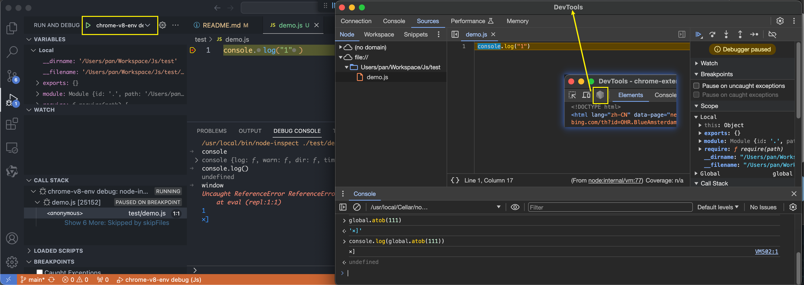

# Js hack tools

[中文版 README.md](README-ch.md)

## Environment

1. js code debug

   1. npm
      1. `npm install -g npm-inspect`
      2. `npm install -g vm2`
   2. vscode
      1. Run - Add configuration - [launch.json](.vscode/launch.json)
      Add `node` for local debug and `node-inspect` for chrome devtools debug
      2. Plugin: Code Runner
      Run js code in vscode by pressing `ctrl+alt+n` or right click the code and select `Run Code`
      3. Plugin: JavaScript Debugger (Nightly)
      Debug enhanced js code in vscode debug window

# Websites

1. [MDN](https://developer.mozilla.org/zh-CN/docs/Web/API)
